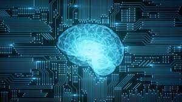
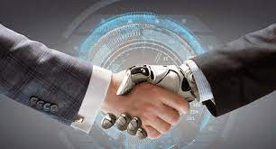
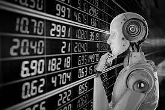
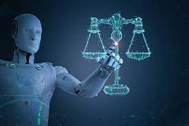

# Introduction

## Qu'est-ce que l'intelligence artificielle (IA) ?

> L'intelligence artificielle est la simulation des processus de l'intelligence humaine par des machines, en particulier des systèmes informatiques. Les applications spécifiques de l'IA comprennent les systèmes experts , le traitement du langage naturel, la reconnaissance vocale et la vision par ordinateur .

---

## Comment fonctionne l'IA ?

> Alors que le battage médiatique autour de l'IA s'est accéléré, les fournisseurs se sont efforcés de promouvoir la manière dont leurs produits et services utilisent l'IA. Souvent, ce qu'ils appellent l'IA n'est qu'un composant de l'IA, comme l'apprentissage automatique . L'IA nécessite une base de matériel et de logiciels spécialisés pour l'écriture et la formation d'algorithmes d'apprentissage automatique. Aucun langage de programmation n'est synonyme d'IA, mais quelques-uns, dont Python, R et Java, sont populaires.
>
> En général, les systèmes d'IA fonctionnent en ingérant de grandes quantités de données d'entraînement étiquetées, en analysant les données pour les corrélations et les modèles, et en utilisant ces modèles pour faire des prédictions sur les états futurs. De cette manière, un chatbot qui reçoit des exemples de chats textuels peut apprendre à produire des échanges réalistes avec les gens, ou un outil de reconnaissance d'images peut apprendre à identifier et décrire des objets dans des images en examinant des millions d'exemples.
>
> La programmation de l'IA se concentre sur trois compétences cognitives : **l'apprentissage, le raisonnement et l'autocorrection.**

---

* **Processus d'apprentissage:**

> Cet aspect de la programmation de l'IA se concentre sur l'acquisition de données et la création de règles sur la 			façon de transformer les données en informations exploitables. Les règles, appelées algorithmes, fournissent aux 				appareils informatiques des instructions étape par étape sur la façon d'accomplir une tâche spécifique.

---

* **Processus de raisonnement :**

> Cet aspect de la programmation de l'IA se concentre sur le choix du bon algorithme pour atteindre le résultat souhaité.

---

* **Processus d'autocorrection:**

> Cet aspect de la programmation de l'IA est conçu pour affiner en permanence les algorithmes et garantir qu'ils fournissent les résultats les plus précis possibles.

---

## Quels sont les avantages et les inconvénients de l'intelligence artificielle ?

> Les réseaux de neurones artificiels et les technologies d'intelligence artificielle d'apprentissage en profondeur évoluent rapidement, principalement parce que l'IA traite de grandes quantités de données beaucoup plus rapidement et fait des prédictions plus précises qu'il n'est humainement possible.
>
> Alors que l'énorme volume de données créées quotidiennement enterrerait un chercheur humain, les applications d'IA qui utilisent l'apprentissage automatique peuvent prendre ces données et les transformer rapidement en informations exploitables. Au moment d'écrire ces lignes, le principal inconvénient de l'utilisation de l'IA est qu'il est coûteux de traiter les grandes quantités de données nécessaires à la programmation de l'IA.

---

* **Avantages :**

> Bon pour les travaux axés sur les détails ;
>
> Temps réduit pour les tâches gourmandes en données ;
>
> Les agents virtuels alimentés par l'IA sont toujours disponibles.

---

* **Désavantages**

> Cher;
>
> Nécessite une expertise technique approfondie ;
>
> Offre limitée de travailleurs qualifiés pour créer des outils d'IA ;
>
> Manque de capacité à généraliser d'une tâche à l'autre.

---

## IA forte contre IA faible

***L'IA peut être classée comme faible ouforte.***

* **L'IA faible :**

> Également connue sous le nom d'IA étroite, est un système d'IA conçu et formé pour accomplir une tâche spécifique. Les robots industriels et les assistants personnels virtuels, tels que Siri d'Apple, utilisent une IA faible.

---

* **L'IA forte :**

> Également connue sous le nom d'intelligence générale artificielle (AGI), décrit une programmation capable de reproduire les capacités cognitives du cerveau humain. Lorsqu'il est confronté à une tâche inconnue, un système d'IA puissant peut utiliser la logique floue pour appliquer les connaissances d'un domaine à un autre et trouver une solution de manière autonome. En théorie, un programme d'IA solide devrait pouvoir réussir à la fois untest de Turinget le test de salle chinois.

---

## Quels sont les 4 types d'intelligence artificielle ?

> Arend Hintze, professeur adjoint de biologie intégrative et d'informatique et d'ingénierie à la Michigan State University, a expliqué dans un article de 2016 que l'IA peut être classée en quatre types, en commençant par les systèmes intelligents spécifiques à une tâche largement utilisés aujourd'hui et en progressant vers les systèmes sensibles. , qui n'existent pas encore. Les catégories sont les suivantes :

---

* **Type 1 : Machines réactives :**

> Ces systèmes d'IA n'ont pas de mémoire et sont spécifiques à une tâche. Un exemple est Deep Blue, le programme d'échecs d'IBM qui a battu Garry Kasparov dans les années 1990. Deep Blue peut identifier des pièces sur l'échiquier et faire des prédictions, mais comme il n'a pas de mémoire, il ne peut pas utiliser les expériences passées pour informer les futures.

---

* **Type 2 : Mémoire limitée:**

> Ces systèmes d'IA ont de la mémoire, ils peuvent donc utiliser les expériences passées pour éclairer les décisions futures. Certaines des fonctions de prise de décision dans les voitures autonomes sont conçues de cette façon.

---

* **Type 3 : Théorie de l'esprit:**

> La théorie de l'esprit est un terme de psychologie. Appliqué à l'IA, cela signifie que le système aurait l'intelligence sociale pour comprendre les émotions. Ce type d'IA sera capable de déduire les intentions humaines et de prédire le comportement, une compétence nécessaire pour que les systèmes d'IA deviennent des membres à part entière des équipes humaines.

---

* **Type 4 :Conscience de soi:**

> Dans cette catégorie, les systèmes d'IA ont un sens de soi, ce qui leur donne une conscience. Les machines conscientes d'elles-mêmes comprennent leur propre état actuel. Ce type d'IA n'existe pas encore.

---

## Pourquoi l'intelligence artificielle est-elle importante ?

> L'IA est importante car elle peut donner aux entreprises un aperçu de leurs opérations dont elles n'avaient peut-être pas connaissance auparavant et parce que, dans certains cas, l'IA peut effectuer des tâches mieux que les humains. En particulier lorsqu'il s'agit de tâches répétitives et détaillées telles que l'analyse d'un grand nombre de documents juridiques pour s'assurer que les champs pertinents sont correctement remplis, les outils d'IA effectuent souvent les tâches rapidement et avec relativement peu d'erreurs .
>
> Cela a contribué à alimenter une explosion de l'efficacité et a ouvert la porte à des opportunités commerciales entièrement nouvelles pour certaines grandes entreprises. Avant la vague actuelle d'IA, il aurait été difficile d'imaginer utiliser un logiciel informatique pour connecter les usagers aux taxis, mais aujourd'hui, Uber est devenue l'une des plus grandes entreprises au monde en faisant exactement cela. Il utilise des algorithmes d'apprentissage automatique sophistiqués pour prédire quand les gens sont susceptibles d'avoir besoin de trajets dans certaines zones, ce qui aide à mettre les conducteurs sur la route de manière proactive avant qu'ils ne soient nécessaires.

---

## Quels sont les exemples de technologie d'IA et comment est-elle utilisée aujourd'hui ?

 ***L'IA est intégrée dans une variété de différents types de technologies.***

**Voici six exemples :**

---

* ***Automatisation:***

> Lorsqu'ils sont associés aux technologies d'IA, les outils d'automatisation peuvent augmenter le volume et les types de tâches effectuées. Un exemple est l'automatisation robotique des processus (RPA ), un type de logiciel qui automatise les tâches de traitement de données répétitives et basées sur des règles traditionnellement effectuées par des humains. Lorsqu'elle est associée à l'apprentissage automatique et aux outils d'IA émergents, la RPA peut automatiser de plus grandes parties des tâches de l'entreprise, permettant aux robots tactiques de la RPA de transmettre les informations de l'IA et de réagir aux changements de processus.

---

* **Apprentissage automatique:**

> C'est la science qui consiste à faire fonctionner un ordinateur sans programmer. L'apprentissage en profondeur est un sous-ensemble de l'apprentissage automatique qui, en termes très simples, peut être considéré comme l'automatisation de l'analyse prédictive. Il existe trois types d'algorithmes d'apprentissage automatique :
>
> 
>
> * **Apprentissage supervisé**:
>
>     Les ensembles de données sont étiquetés afin que les modèles puissent être détectés et utilisés pour étiqueter de nouveaux ensembles de données.
>
> ---
>
> 
>
> * **Apprentissage non supervisé:**
>
>     Les ensembles de données ne sont pas étiquetés et sont triés en fonction des similitudes ou des différences.
>
> ---
>
> 
>
> * **Apprentissage par renforcement**:
>
>     Les ensembles de données ne sont pas étiquetés mais, après avoir effectué une action ou plusieurs actions, le système d'IA reçoit un retour.

---

* **Vision artificielle:**

> Cette technologie donne à une machine la capacité de voir. La vision artificielle capture et analyse les informations visuelles à l'aide d'une caméra, d'une conversion analogique-numérique et d'un traitement numérique du signal. Elle est souvent comparée à la vue humaine, mais la vision artificielle n'est pas liée à la biologie et peut être programmée pour voir à travers les murs, par exemple. Il est utilisé dans une gamme d'applications allant de l'identification de signature à l'analyse d'images médicales. La vision par ordinateur , qui se concentre sur le traitement d'images par ordinateur, est souvent confondue avec La vision artificielle.

---

* **Traitement du langage naturel (TAL):**

> C'est le traitement du langage humain par un programme informatique. L'un des exemples les plus anciens et les plus connus de NLP est la détection de spam, qui examine la ligne d'objet et le texte d'un e-mail et décide s'il s'agit d'un courrier indésirable. Les approches actuelles de la PNL sont basées sur l'apprentissage automatique. Les tâches de la PNL incluent la traduction de texte, l'analyse des sentiments et la reconnaissance vocale.

---

* **Robotique:**

> Ce domaine de l'ingénierie se concentre sur la conception et la fabrication de robots. Les robots sont souvent utilisés pour effectuer des tâches difficiles à effectuer ou à effectuer de manière cohérente pour les humains. Par exemple, les robots sont utilisés dans les chaînes de montage pour la production automobile ou par la NASA pour déplacer de gros objets dans l'espace. Les chercheurs utilisent également l'apprentissage automatique pour construire des robots capables d'interagir dans des contextes sociaux.

---

* **Voitures autonomes**

> Les véhicules autonomes utilisent une combinaison de vision par ordinateur, de reconnaissance d'image et d'apprentissage en profondeur pour développer des compétences automatisées pour piloter un véhicule tout en restant dans une voie donnée et en évitant les obstacles inattendus, tels que les piétons.

---

## Quelles sont les applications de l'IA ?

**L'intelligence artificielle a fait son chemin dans unegrande variété de marchés .**

**Voici neuf exemples:**

---

* **L'IA dans la santé:**

> Les plus gros paris sont sur l'amélioration des résultats pour les patients et la réduction des coûts. Les entreprises appliquent l'apprentissage automatique pour établir des diagnostics meilleurs et plus rapides que les humains. L'une des technologies de soins de santé les plus connues est IBM Watson. Il comprend le langage naturel et peut répondre aux questions qui lui sont posées. Le système extrait les données des patients et d'autres sources de données disponibles pour formuler une hypothèse, qu'il présente ensuite avec un schéma de notation de confiance. D'autres applications d'IA incluent l'utilisation d'assistants de santé virtuels en ligne et de chatbots pour aider les patients et les clients du secteur de la santé à trouver des informations médicales, à planifier des rendez-vous, à comprendre le processus de facturation et à effectuer d'autres processus administratifs. Un éventail de technologies d'IA est également utilisé pour prédire, combattre et comprendrepandémies telles que COVID-19 .

---

* **L'IA en entreprise:**

> Des algorithmes d'apprentissage automatique sont intégrés aux plates-formes d'analyse et de gestion de la relation client (CRM ) pour découvrir des informations sur la façon de mieux servir les clients. Les chatbots ont été intégrés aux sites Web pour fournir un service immédiat aux clients. L'automatisation des postes de travail est également devenue un sujet de discussion parmi les universitaires et les analystes informatiques.

---

* **L'IA dans l'éducation:**

> L'IA peut automatiser la notation, ce qui donne plus de temps aux enseignants. Il peutévaluer les étudiants et s'adapter à leurs besoins , en les aidant à travailler à leur propre rythme. Les tuteurs d'IA peuvent fournir un soutien supplémentaire aux étudiants, en s'assurant qu'ils restent sur la bonne voie. Et cela pourrait changer où et comment les élèves apprennent, peut-être même remplacer certains enseignants.

---

* **L'IA dans la finance:**

> L'IA dans les applications de finances personnelles, telles que Intuit Mint ou TurboTax, perturbe les institutions financières. De telles applications collectent des données personnelles et fournissent des conseils financiers. D'autres programmes, comme IBM Watson, ont été appliqués au processus d'achat d'une maison. Aujourd'hui, les logiciels d'intelligence artificielle effectuent une grande partie des échanges à Wall Street.

---

* **L'IA en droit:**

> Le processus de découverte - passer au crible les documents - en droit est souvent écrasant pour les humains. L'utilisation de l'IA pour aider à automatiser les processus à forte intensité de main-d'œuvre du secteur juridique permet de gagner du temps et d'améliorer le service client. Les cabinets d'avocats utilisent l'apprentissage automatique pour décrire les données et prédire les résultats, la vision par ordinateur pour classer et extraire les informations des documents et le traitement du langage naturel pour interpréter les demandes d'informations.

---

* **L'IA dans la fabrication:**

> La fabrication a été à l'avant-garde de l'intégration de robots dans le flux de travail . Par exemple, les robots industriels qui étaient à un moment programmés pour effectuer des tâches uniques et séparés des travailleurs humains, fonctionnent de plus en plus comme des cobots : des robots plus petits et multitâches qui collaborent avec les humains et assument la responsabilité de plus de parties du travail dans les entrepôts, les usines et autres espaces de travail.

---

* **L'IA dans le secteur bancaire:**

> Les banques utilisent avec succès des chatbots pour informer leurs clients des services et des offres et pour gérer les transactions qui ne nécessitent pas d'intervention humaine. Les assistants virtuels IA sont utilisés pour améliorer et réduire les coûts de conformité aux réglementations bancaires. Les organisations bancaires utilisent également l'IA pour améliorer leur prise de décision en matière de prêts, pour fixer des limites de crédit et identifier les opportunités d'investissement.

---

* **L'IA dans les transports:**

> Outre le rôle fondamental de l'IA dans l'exploitation de véhicules autonomes, les technologies d'IA sont utilisées dans les transports pour gérer le trafic, prévoir les retards de vol et rendre le transport maritime plus sûr et plus efficace.

---

* **Sécurité:**

> L'IA et l'apprentissage automatique figurent en tête de liste des mots à la mode que les fournisseurs de sécurité utilisent aujourd'hui pour différencier leurs offres. Ces termes représentent également des technologies véritablement viables. Les organisations utilisent l'apprentissage automatique dans les logiciels de gestion des informations et des événements de sécurité (SIEM ) et dans les domaines connexes pour détecter les anomalies et identifier les activités suspectes qui indiquent des menaces. En analysant les données et en utilisant la logique pour identifier les similitudes avec le code malveillant connu, l'IA peut fournir des alertes aux attaques nouvelles et émergentes beaucoup plus tôt que les employés humains et les itérations technologiques précédentes. La technologie en pleine maturité joue un rôle important pour aider les organisations à lutter contre les cyberattaques.
